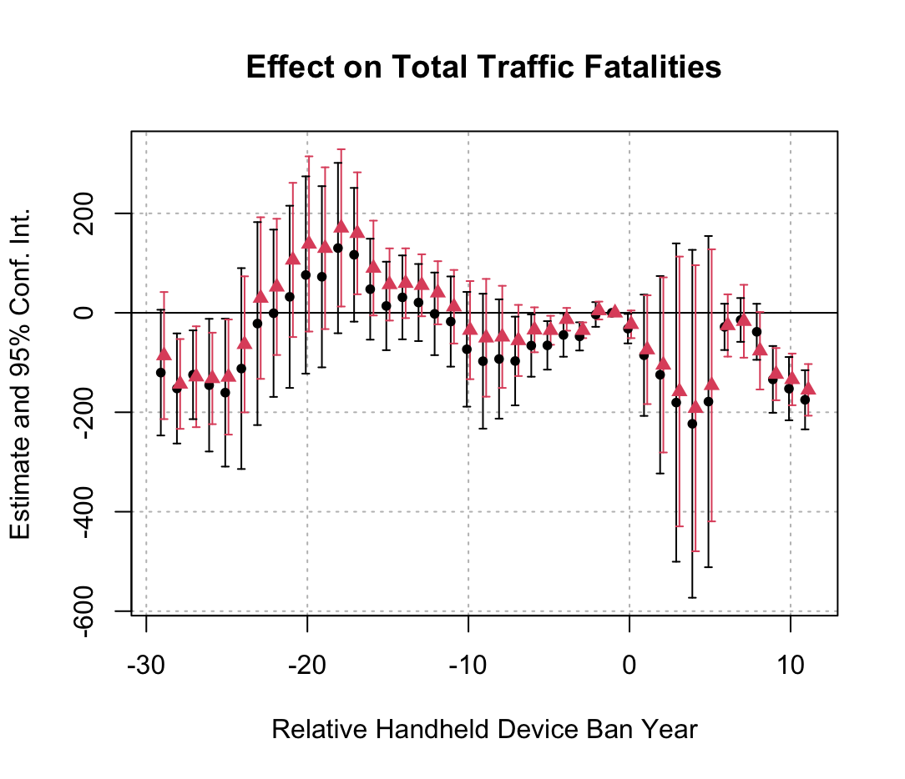
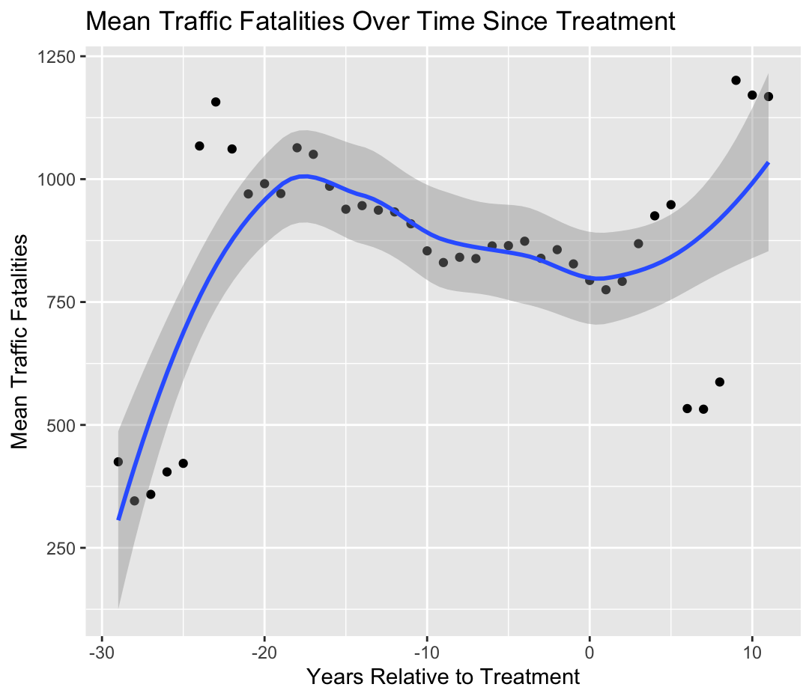

# Impact of Handheld Device Bans on Traffic Fatalities

## Project Overview
This project analyzes the effectiveness of handheld device bans on traffic fatalities across U.S. states from 1983 to 2012. Using advanced econometric methods including Fixed Effects models, Difference-in-Differences (DiD), and the Sun & Abraham estimator, we examine how these policies affect different types of traffic fatalities while controlling for various demographic and infrastructure factors. The .pdf version of the poster can be accessed [here](traffic_fat_poster.pdf)

## Poster Visualization


## Background and Methodology
Our analysis leverages a comprehensive dataset of state-level traffic fatalities, combining it with policy implementation dates and various control variables. We employ several methodological approaches:

### Methodological Approaches
1. **Fixed Effects Models**: Control for time-invariant state characteristics and temporal trends
2. **Difference-in-Differences**: Exploit policy variation across states and time
3. **Sun & Abraham Estimator**: Account for treatment effect heterogeneity

### Key Model Specifications
```R
# Base Fixed Effects Model
m1 = feols(totfat ~ hha | state + year, 
          cluster = ~ state, data)

# Full Model with Controls
m5 = feols(c(totfat, occfat, noccfat) ~ 
           hha + totpop + avgage + pcinc + lim70 | 
           state + year, 
           cluster = ~ state, data)

#  Statewide Variables
s2 = feols(c(totfat, occfat, noccfat) ~ 
           hha + totpop + avgage + pcinc + lim70 + fueltax +
           milrur * rurdense + milurb * urbdense | 
           state + year, 
           cluster = ~ state, data)

#  Fixed Effect Regressions
t3 = feols(noccfat ~ 
           hha + totpop + avgage + pcinc + lim70 + fueltax | 
           state + year, 
           cluster = ~ state, data)
```

## Data Analysis
We examine multiple `outcome variables`:
- Total traffic fatalities
- Occupant fatalities
- Non-occupant fatalities

`Control variables` include:
- Population demographics
- Economic indicators
- Road infrastructure characteristics
- Speed limit policies
- Fuel taxes

### Sample Visualization 1: Event Study Analysis
```R
# Sun and Abraham Estimator
d4 = feols(totfat ~ sunab(mintreatyear, year) + totpop + avgage + pcinc + lim70 + fueltax | state + year, data = data, cluster = ~ state)

d5 = feols(totfat ~ sunab(mintreatyear, year) + totpop + avgage + pcinc + lim70 + fueltax + milrur * milurb + rurdense * urbdense | state + year, data = data, cluster = ~ state
)

iplot(
  list(d5, d4),
  xlab = "Relative Handheld Device Ban Year",
  main = "Effect on Total Traffic Fatalities"
)
```


### Sample Visualization 2: Average Traffic Fatalities Over Time

```R
ggplot(data_c, aes(x = tau, y = mean_fat)) +
  geom_point() +
  geom_smooth(method = "loess") +
  xlab("Years Relative to Treatment") +
  ylab("Mean Traffic Fatalities") +
  ggtitle("Mean Traffic Fatalities Over Time Since Treatment")
```


## Requirements
- R version 4.0+
- Required packages:
  ```R
  library(tidyverse)
  library(fixest)
  library(plm)
  library(estimatr)
  library(stargazer)
  ```

## Usage
1. Clone the repository
2. Install required packages:
```R
install.packages(c("tidyverse", "fixest", "plm", "estimatr", "stargazer"))
```
3. Run the analysis:
```R
source("traffic_fat_script.R")
```
